# Yeray Candel

### `> Full Stack & Software Developer_`

 

### 🎮 [&gt; PLAY PONG](https://ycansam.github.io/ycansam/pong.html)

 

🏢 **Frontend Developer** at [Oxigent Technologies (Zara / Inditex)](https://www.inditex.com)

> _For every problem there is a solution._

 

---

## 🛠️ Tech Stack

**Languages & Frameworks**

**Databases & ORMs**

**Tools & DevOps**

---

## 💼 Experience

| Company | Role | Period |
|---------|------|--------|
| **Oxigent Technologies (Zara.com)** | Frontend Developer | 2023 – Present |
| **INSYDE SL** | Full Stack Developer | 2022 – 2023 |
| **Ysolve.es** | Freelance Developer | 2022 – 2023 |
| **Carrefour** | Logistics | 2019 – 2020 |

---

## 📊 GitHub Stats

  
  

---

  ⚡ 4+ years of experience · 17+ projects · 20+ technologies

